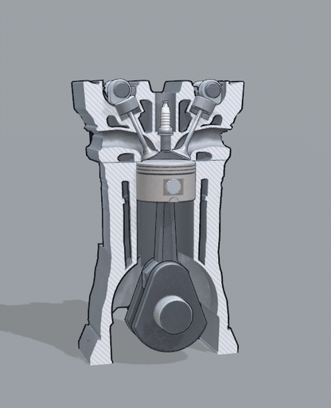
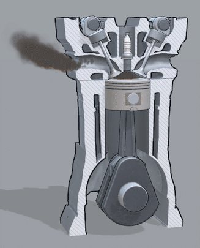

# Otto Engine Cutaway

*Otto Engine Cutaway* is an interactive, animated cutaway of a single-cylinder four-stroke (Otto) petrol engine that runs directly in the browser. Step through intake, compression, power and exhaust one stroke at a time, or let the engine run, and orbit around it to look into the cylinder, the ports and the valve train. It was originally built as the engine assembly example for the [TrainAR](https://github.com/jblattgerste/TrainAR) framework and is published here on its own as a small, freely reusable teaching asset.

[](https://jblattgerste.github.io/OttoEngine-3D-Animation/)
[](CITATION.cff)
[](LICENSE)

<p align="center">
  
  
</p>

## What You See

| Stroke | Crank angle | What happens |
|---|---|---|
| Intake | 0–180° | The piston moves down, the intake valve opens and fresh air carries a fine mist of fuel into the cylinder. |
| Compression | 180–360° | Both valves are closed and the rising piston squeezes the mixture into the combustion chamber. |
| Power | 360–540° | The spark plug fires, the mixture burns and the hot gas pushes the piston down; the only stroke that makes power. |
| Exhaust | 540–720° | The exhaust valve opens and the rising piston pushes the burnt gas out. |

One cycle takes two crankshaft turns. The two overhead camshafts turn at half the crankshaft's speed and open each valve once per cycle (intake 6–224°, exhaust 496–714°, 6.8 mm lift).

The engine has real proportions (bore 80 mm, stroke 80 mm, connecting rod 130 mm) and consists of the cut-open block with a pent-roof combustion chamber, ports, cam saddles and water jacket, a crankshaft with two counterweighted webs, a connecting rod with a bolted cap, a piston with rings and wrist pin, intake and exhaust valves with bucket tappets, two camshafts and a spark plug. All parts move with slider-crank and cam kinematics; a collision check over the full 720° cycle (2° steps) found no intersections.

The motion is slowed down for explanation: a stroke takes 2 s, and the running engine does one cycle in 1.6 s (75 rpm). Simplified on purpose: no valve springs, timing belt, flywheel, oil system, manifolds or injector.

## Repository Contents

- `Assets/OttoEngine/Scenes/OttoEngine.unity`: the scene (engine, camera, lighting, user interface)
- `Assets/OttoEngine/Scripts`: `EngineShowcase` (steps through the phases, captions, controls) and `OrbitCamera` (mouse and touch orbit)
- `Assets/OttoEngine/EngineBlock` and the part folders: models, baked textures and materials
- `Assets/OttoEngine/EngineRig`: the animated engine (FBX with one clip per stroke and the running loop, plus the take-apart clip from TrainAR that is not used here)
- `Assets/OttoEngine/Effects`: one prefab per phase (animated parts, gas effects, engine sound), particle materials, flipbooks and sounds
- `Assets/OttoEngine/Editor/BuildWebGL.cs`: reproducible WebGL build into `WebGL/`
- `Assets/WebGLTemplates/FullWindow`: full-window web page for the build
- `WebGL/`: the current build, published to GitHub Pages by [`.github/workflows/pages.yml`](.github/workflows/pages.yml)
- `Media/`: the GIFs in this README

## Requirements

- Unity 6000.7.0a6 with WebGL Build Support (Universal Render Pipeline 17.7, Input System 6.7)
- For the web version: any browser with WebGL 2

## Getting Started

Open the project through Unity Hub, open `Assets/OttoEngine/Scenes/OttoEngine.unity` and press Play.

Controls:

- **Next stroke** (or Space / right arrow) steps through the strokes, **Run** lets the engine run, **Reset** (or R) goes back to the assembled engine.
- Drag to rotate, scroll or pinch to zoom, double-click or double-tap to reset the view.

To update the web version, run **Otto Engine > Build WebGL** (or headless: `Unity -batchmode -quit -projectPath . -buildTarget WebGL -executeMethod OttoEngine.Editor.BuildWebGL.Build`) and push the changed `WebGL/` folder; the workflow deploys it. GitHub Pages has to be set to *GitHub Actions* once under Settings > Pages.

## How It Was Made

The parts were modelled procedurally in Blender with Python, using the dimensions above, and baked into a technical-illustration look (cel shading, ink outlines, hatched cut faces). The animation clips were keyed from the same kinematics that were used for the collision check. In Unity, the gas is made of particle systems that simulate in the engine's own frame (some emitters ride on the piston), and the engine sounds are generated from the crank angle: intake hiss, a rising compression hum, the ignition, the exhaust puff and the valve ticks, so they stay in step with the animation.

## Citation

If you use this project, please cite it:

```bibtex
@software{Blattgerste2026OttoEngine,
  author = {Blattgerste, Jonas},
  title = {Otto Engine Cutaway: An Interactive Four-Stroke Engine in the Browser},
  year = {2026},
  version = {1.0.0},
  url = {https://github.com/jblattgerste/OttoEngine-3D-Animation},
  note = {Licensed under CC BY 4.0}
}
```

## License

© 2026 Jonas Blattgerste, Mixality Lab, University of Applied Sciences Emden/Leer.

Everything in this repository (models, textures, animations, effects, sounds and code) is licensed under the [Creative Commons Attribution 4.0 International License](LICENSE) (CC BY 4.0). You may share and adapt it for any purpose, including commercially, as long as you give appropriate credit, for example: *"Otto Engine Cutaway" by Jonas Blattgerste, CC BY 4.0*. The Unity packages the project depends on are under their own licenses.
